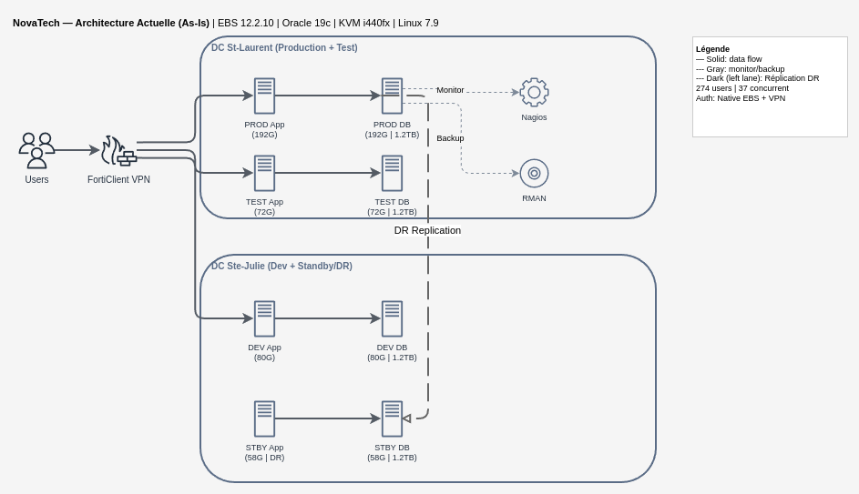
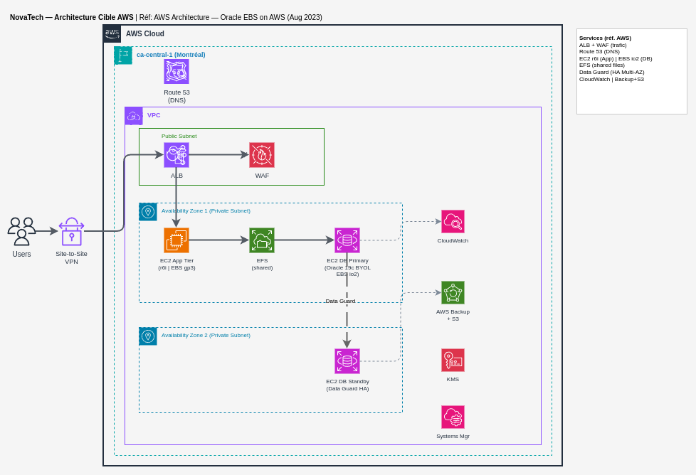

# Contexte et portée du mandat

Dans le cadre de l'évaluation des options de migration pour NovaTech, Alithya a été mandatée pour produire une estimation côté AWS permettant au client de comparer avec la proposition Oracle Cloud Infrastructure (OCI) préparée par l'équipe Oracle.

Le présent document constitue une analyse de haut niveau couvrant le mapping de l'infrastructure actuelle vers des services AWS équivalents, une estimation des coûts (via AWS Pricing Calculator) et une estimation de l'effort de migration.

Le périmètre porte sur la migration lift-and-shift de l'environnement Oracle E-Business Suite 12.2.10 de NovaTech, comprenant quatre environnements : Production, Test, Développement et Standby/DR.

Cette analyse s'appuie sur les guides officiels AWS, notamment le whitepaper « Migrating Oracle E-Business Suite on AWS » et l'architecture de référence « Oracle E-Business Suite on AWS », publiés par AWS.

# État actuel (As-Is)

## Architecture actuelle

NovaTech exploite Oracle E-Business Suite version 12.2.10 avec une base de données Oracle 19.21.0.0.0 sur Linux x86-64 version 7.9. L'infrastructure est virtualisée sur KVM (i440fx) et répartie entre deux centres de données au Québec.

L'environnement supporte 274 utilisateurs (37 concurrents) et opère en bilingue (anglais US + français canadien). L'authentification est native EBS avec accès distant via FortiClient VPN.

## Inventaire des environnements

| Environnement | Localisation | Tier | CPU Cores | RAM | Stockage | DB Size | IOPS | CPU Avg |
|---|---|---|---|---|---|---|---|---|
| Production | St-Laurent | Application | 4 | 192 GB | 450 GB | — | — | 50% |
| Production | St-Laurent | Database | 4 | 192 GB | 2.7 TB | 1.2 TB | 2000 | 50% |
| Test | St-Laurent | Application | 4 | 72 GB | 340 GB | — | — | 9% |
| Test | St-Laurent | Database | 4 | 72 GB | 2.2 TB | 1.2 TB | — | 9% |
| Développement | Ste-Julie | Application | 3 | 80 GB | 460 GB | — | — | 22% |
| Développement | Ste-Julie | Database | 3 | 80 GB | 2.7 TB | 1.2 TB | — | 22% |
| Standby/DR | Ste-Julie | Application | 1 | 58 GB | — | — | — | — |
| Standby/DR | Ste-Julie | Database | 1 | 58 GB | 2.5 TB | 1.2 TB | — | — |

## Sauvegarde et DR

1. Backups RMAN : full hebdomadaire, incrémentaux quotidiens, archivelog toutes les 2 heures
2. Standby database pour failover en cas de panne du site primaire
3. Les environnements non-production sont des copies complètes de la production

## Monitoring et patching

1. Monitoring : Nagios
2. Patching : 1 à 2 fois par an
3. SDLC : Development → Test → Patch → Production

# Architecture cible AWS

## Approche de migration

Conformément au whitepaper AWS « Migrating Oracle E-Business Suite on AWS », l'approche recommandée pour les environnements Oracle EBS est le lift-and-shift. Cette approche permet de migrer l'environnement tel quel vers AWS avec un minimum de modifications, tout en bénéficiant de la flexibilité, de la haute disponibilité et de l'élasticité du cloud.

L'outil de migration recommandé par AWS est AWS Application Migration Service (AWS MGN), qui effectue une réplication au niveau bloc des serveurs sources vers AWS. Pour le tier base de données, AWS recommande l'utilisation des outils natifs Oracle (RMAN, Data Guard) plutôt que MGN.

## Mapping des services AWS

Le mapping suivant traduit chaque composant de l'infrastructure actuelle vers son équivalent AWS, en suivant l'architecture de référence AWS « Oracle E-Business Suite on AWS ».

### Tier Application (Middleware EBS)

1. **Service AWS** : Amazon EC2 (instances r6i optimisées mémoire)
2. **Stockage applicatif** : Amazon EBS gp3 pour les volumes locaux
3. **Système de fichiers partagé** : Amazon EFS ou Amazon FSx for NetApp ONTAP pour les fichiers applicatifs E-Business Suite partagés entre les tiers
4. **Load Balancer** : Application Load Balancer (ALB) pour la distribution du trafic et la terminaison SSL/TLS
5. **Sécurité web** : AWS WAF pour la protection contre les exploits web courants

### Tier Base de Données (Oracle 19c)

1. **Option 1 — EC2 self-managed (BYOL)** : Amazon EC2 avec Oracle Database Enterprise Edition, gestion complète par le client (patching, backup, HA). Recommandé pour un contrôle total et lorsque des fonctionnalités Oracle avancées non supportées par RDS Custom sont requises.
2. **Option 2 — Amazon RDS Custom for Oracle (BYOL)** : Service semi-managé qui offre l'accès OS tout en automatisant certaines tâches d'administration. Recommandé lorsque le client souhaite réduire la charge opérationnelle tout en gardant accès au système d'exploitation.
3. **Stockage base de données** : Amazon EBS io2 Block Express (provisioned IOPS) pour la performance de la base de données. Jusqu'à 256K IOPS par volume. Optionnellement, Oracle ASM pour le striping et mirroring.

### Haute disponibilité et DR

1. **HA intra-région** : Déploiement multi-AZ avec Oracle Data Guard Physical Standby pour le failover automatique de la base de données. Correspond à l'architecture de référence AWS pour EBS.
2. **DR inter-région** : Réplication cross-region via Data Guard pour la base de données. AWS Backup pour les politiques de sauvegarde centralisées (EC2, EBS, S3).
3. **Remplacement du standby actuel** : Le serveur standby de Ste-Julie est remplacé par une instance EC2 dans une seconde AZ (ou une seconde région selon les exigences RTO/RPO).

### Réseau et connectivité

1. **VPC** : Un VPC dédié avec sous-réseaux privés (application + base de données) et sous-réseaux publics (ALB)
2. **Connectivité** : AWS Site-to-Site VPN ou AWS Direct Connect pour la connexion sécurisée depuis les bureaux NovaTech
3. **DNS** : Amazon Route 53 pour le routage et la résolution DNS
4. **Accès bastion** : AWS Systems Manager Session Manager (accès sans bastion aux instances privées)

### Sécurité

1. **Chiffrement** : AWS KMS pour le chiffrement at-rest (volumes EBS, S3). TLS pour le transit.
2. **Gestion des secrets** : AWS Secrets Manager pour les mots de passe applicatifs
3. **Audit** : AWS CloudTrail pour la journalisation des appels API
4. **Conformité** : AWS Security Hub et Amazon GuardDuty pour la détection de menaces

### Sauvegarde

1. **Remplacement RMAN** : AWS Backup pour orchestrer les politiques de sauvegarde de manière centralisée
2. **Stockage backups** : Amazon S3 (Standard pour les backups récents, Glacier pour la rétention long terme)
3. **Note** : RMAN peut continuer à être utilisé pour les backups Oracle natifs, avec stockage sur EBS ou S3 via Oracle Secure Backup ou AWS Storage Gateway

### Monitoring

1. **Remplacement Nagios** : Amazon CloudWatch pour les métriques, logs et alarmes
2. **Dashboards** : CloudWatch Dashboards pour la visibilité centralisée
3. **Alertes** : CloudWatch Alarms avec notifications SNS

## Synthèse du mapping

1. **KVM VMs → Amazon EC2** (instances r6i pour mémoire, m6i pour compute)
2. **Stockage local → Amazon EBS gp3/io2**
3. **Standby DB → Multi-AZ avec Data Guard**
4. **RMAN Backups → AWS Backup + S3**
5. **FortiClient VPN → AWS Client VPN ou Site-to-Site VPN**
6. **Nagios → Amazon CloudWatch**
7. **Authentification EBS → Native EBS (inchangée) + IAM pour l'accès infrastructure**

# Estimation des efforts

L'estimation détaillée de l'effort de migration est présentée dans le document Excel « Plan_Effort_Migration_NovaTech.xlsx » joint au présent livrable.

La méthodologie suit le cadre AWS Migration Acceleration Program (MAP) en trois phases : Assess, Mobilize, Migrate and Modernize.

## Phases de migration

1. **Phase 1 : Analyse et préparation** — Inventaire détaillé des dépendances, documentation architecture actuelle et cible, plan de migration
2. **Phase 2 : Infrastructure AWS** — Provisionnement VPC, sous-réseaux, groupes de sécurité, connectivité VPN/Direct Connect, instances EC2
3. **Phase 3 : Migration base de données** — Réplication via RMAN ou Data Guard vers EC2/RDS Custom. Configuration standby multi-AZ
4. **Phase 4 : Migration application tier** — Réplication via AWS MGN des serveurs applicatifs. Configuration EFS/FSx pour le filesystem partagé. Autoconfig et PostClone
5. **Phase 5 : Tests et validation** — Vérification complétude migration, tests performance, validation fonctionnelle E-Business Suite
6. **Phase 6 : Basculement et mise en production** — Cutover DNS via Route 53, validation opérationnelle, support post-basculement
7. **Phase 7 : Optimisation et finalisation** — Configuration haute disponibilité, optimisation coûts, documentation, formation

# Estimation des coûts

L'estimation détaillée des coûts est présentée dans le rapport d'estimation de coûts AWS joint au présent livrable.

Les principaux postes de coûts identifiés sont les suivants.

## Services AWS — Estimation mensuelle

1. **Amazon EC2** — Instances pour les tiers application et base de données (4 environnements)
2. **Amazon EBS** — Volumes io2 (base de données) et gp3 (application)
3. **Amazon EFS/FSx** — Système de fichiers partagé pour les fichiers applicatifs EBS
4. **Elastic Load Balancing** — ALB pour la distribution du trafic
5. **Réseau** — NAT Gateway, VPN Site-to-Site ou Direct Connect
6. **Sauvegarde** — AWS Backup, Amazon S3
7. **Monitoring** — Amazon CloudWatch
8. **Sécurité** — AWS KMS, Secrets Manager, Security Hub

## Considérations de licence Oracle

Conformément aux recommandations AWS, le modèle BYOL (Bring Your Own License) est recommandé pour Oracle Database Enterprise Edition. AWS offre des options d'optimisation CPU (désactivation du multithreading, personnalisation du nombre de cores) permettant de réduire les coûts de licence Oracle, celle-ci étant basée sur la taille de l'instance.

# Risques et mitigations

1. **Licence Oracle sur AWS** — Le licensing Oracle est complexe et basé sur le nombre de vCPUs. Mitigation : utiliser les options d'optimisation CPU d'AWS et valider avec Oracle LMS avant la migration.
2. **Performance base de données** — Le changement de stockage (local → EBS) peut impacter les performances I/O. Mitigation : utiliser EBS io2 avec provisioned IOPS dimensionné selon les besoins actuels (2000 IOPS minimum).
3. **Connectivité réseau** — La latence entre les bureaux NovaTech et AWS peut différer de celle vers les data centers actuels. Mitigation : évaluer Direct Connect vs VPN selon les exigences de latence.
4. **Temps d'arrêt migration** — Le cutover nécessite une fenêtre de maintenance. Mitigation : utiliser Data Guard pour minimiser le downtime (réplication continue puis switchover rapide).
5. **Compétences équipe** — L'équipe NovaTech devra acquérir des compétences AWS pour l'opération au quotidien. Mitigation : formation AWS et support post-migration inclus dans l'effort.

# Recommandation

Sur la base de l'analyse de l'infrastructure actuelle et des architectures de référence AWS pour Oracle E-Business Suite, nous recommandons l'approche suivante.

1. **Migration lift-and-shift** vers Amazon EC2 en utilisant AWS Application Migration Service (MGN) pour les tiers applicatifs et les outils natifs Oracle (RMAN/Data Guard) pour la base de données.
2. **Oracle Database sur EC2 avec BYOL** pour conserver le contrôle total et minimiser les changements. Amazon RDS Custom for Oracle peut être évalué comme option future de re-platforming.
3. **Architecture multi-AZ** pour la haute disponibilité, avec Data Guard pour le failover automatique de la base de données.
4. **Région ca-central-1 (Montréal)** pour la conformité aux exigences de résidence des données au Canada.

Cette approche est directement alignée avec le whitepaper AWS « Migrating Oracle E-Business Suite on AWS » et l'architecture de référence AWS « Oracle E-Business Suite on AWS », qui documentent précisément ce scénario de migration.

# Références AWS

1. AWS Whitepaper — Migrating Oracle E-Business Suite on AWS (https://docs.aws.amazon.com/whitepapers/latest/migrating-oracle-e-business-suite/)
2. AWS Architecture Reference — Oracle E-Business Suite on AWS (https://docs.aws.amazon.com/architecture-diagrams/latest/oracle-e-business-suite-on-aws/)
3. AWS Blog — Migrate Oracle applications and databases using AWS Application Migration Service (https://aws.amazon.com/blogs/database/migrate-oracle-applications-and-databases-using-aws-application-migration-service/)
4. AWS Prescriptive Guidance — Oracle Database licensing on AWS (https://docs.aws.amazon.com/prescriptive-guidance/latest/migration-oracle-database/licensing.html)
5. AWS Blog — Build resilient Oracle Database workloads on Amazon EC2 (https://aws.amazon.com/blogs/database/build-resilient-oracle-database-workloads-on-amazon-ec2/)
6. AWS Whitepaper — Overview of Oracle E-Business Suite on AWS (https://docs.aws.amazon.com/whitepapers/latest/overview-oracle-e-business-suite/)
7. AWS — Oracle Applications on AWS Resources (https://aws.amazon.com/oracle-apps/resources/)
